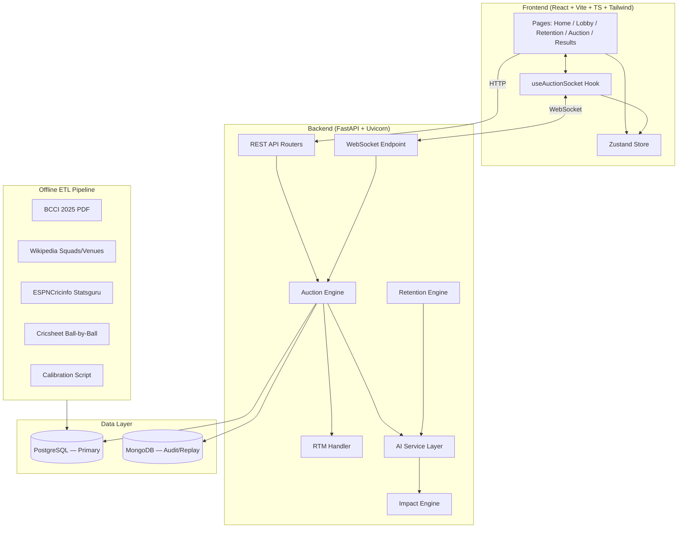
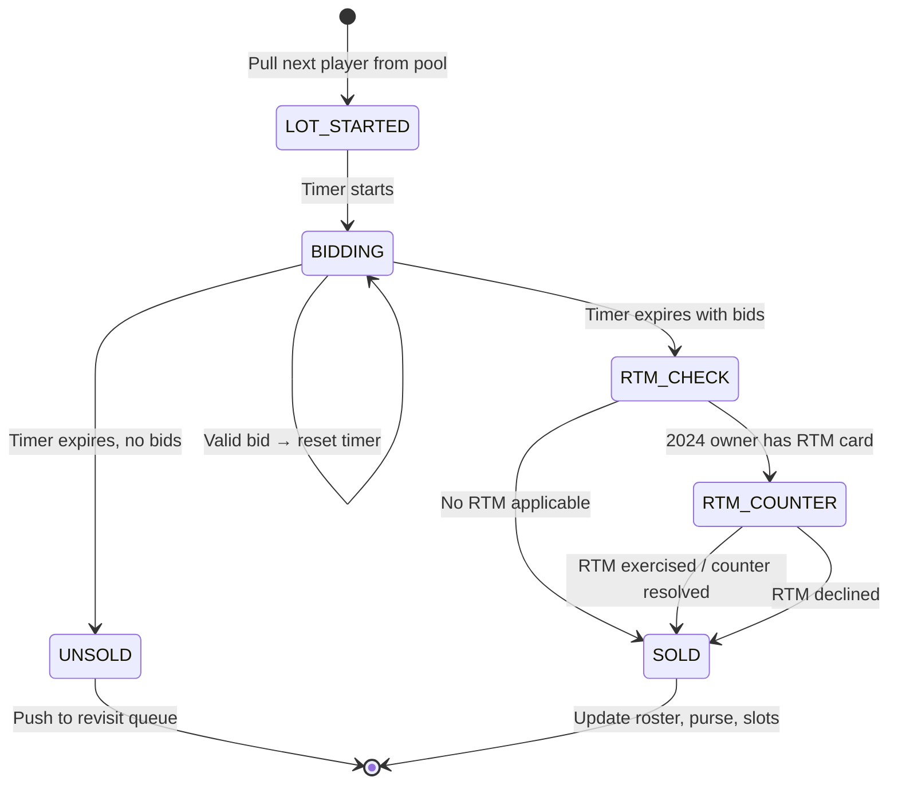

# AI-Powered IPL Auction Simulator — Implementation Plan

A full-stack, real-time multiplayer IPL auction simulator with AI-controlled teams, a calibrated Impact Scoring engine, a retention phase mirroring real 2025 mega-auction rules, and RTM (Right-to-Match) mechanics. Supports 10 franchises (human + AI), WebSocket-driven live bidding, and transparent, explainable player valuation.

---

## Architecture Overview



---

## User Review Required

> [!IMPORTANT]
> **Technology Choices Confirmation**
> - **Tailwind CSS**: You specified Tailwind CSS in your plan. Confirming this is intentional (the default guidance prefers vanilla CSS unless explicitly requested).
> - **PostgreSQL + MongoDB**: Dual-database polyglot approach. PostgreSQL for ACID transactional state, MongoDB for schema-flexible audit logs and replay documents. Confirm you want both from day one, or defer MongoDB to Phase 9 as your roadmap suggests.

> [!WARNING]
> **Data Sourcing Legality**
> - Scraping ESPNCricinfo and Wikipedia is fragile and may break. Cricsheet.org data is openly licensed. The BCCI PDF is a one-time manual extraction. Consider maintaining a fallback static dataset (`data/raw/`) so the app doesn't depend on live scraping at any point.

> [!IMPORTANT]
> **Deployment Target**
> - The plan mentions Render/Railway + Vercel/Netlify for hosting, and also LAN testing. Should the initial build target local-only development, or should we set up cloud deployment infrastructure from Phase 0?

## Open Questions

1. **Player image assets** — Do you want player photos in the UI? If yes, source? (Cricinfo images are copyrighted; we could use initials/avatars as placeholders.)
2. **Authentication** — The plan mentions `users` table but doesn't specify auth. Is this anonymous (join by room code), or do you want login (OAuth/email)?
3. **Concurrent rooms** — Should the server support multiple simultaneous auction rooms, or is it one-room-at-a-time for v1?
4. **Mobile responsiveness** — Full mobile support, or desktop-first for v1?
5. **Sound effects / commentary** — Any audio feedback for bids, sold, unsold events?
6. **LLM Bidder stub** — You mention Anthropic API. Should we wire the stub to actually call Claude for commentary in v1, or leave it as a pure interface stub?

---

## Proposed Changes

### Phase 0 — Repository Scaffold & Infrastructure

> Estimated effort: ~1 day

Set up the monorepo, backend virtual environment, frontend project, database connections, and a health-check endpoint to confirm everything runs.

---

#### [NEW] `ipl-auction-sim/backend/requirements.txt`

Core Python dependencies:
```
fastapi>=0.110
uvicorn[standard]>=0.27
sqlalchemy>=2.0
psycopg2-binary>=2.9
pydantic>=2.0
alembic>=1.13
python-dotenv>=1.0
pandas>=2.1
numpy>=1.26
pdfplumber>=0.10
beautifulsoup4>=4.12
requests>=2.31
pymongo>=4.6
```

#### [NEW] `ipl-auction-sim/backend/app/main.py`

FastAPI application entrypoint with:
- CORS middleware (configurable origins for local + deployed frontend)
- Router mounting for `/api/rooms`, `/api/players`, `/api/admin`
- WebSocket endpoint at `/ws/auction/{room_id}`
- Startup event: DB connection pool init
- Health check at `/health`

#### [NEW] `ipl-auction-sim/backend/app/config.py`

Environment-driven configuration:
- `DATABASE_URL` (PostgreSQL)
- `MONGODB_URI` (MongoDB Atlas or local)
- `CORS_ORIGINS`
- `DEFAULT_PURSE_LAKH = 12000`
- `BID_TIMER_SECONDS = 15`
- `MIN_BID_INCREMENT_LAKH = 25` (₹25L default increment)
- `MAX_SQUAD_SIZE = 25`
- `MAX_OVERSEAS = 8`
- `RETENTION_TIMEOUT_SECONDS = 120`

#### [NEW] `ipl-auction-sim/backend/app/db/database.py`

SQLAlchemy async engine + session factory, connection pooling.

#### [NEW] `ipl-auction-sim/frontend/` (Vite + React + TypeScript + Tailwind)

Scaffold via `npx -y create-vite@latest ./ --template react-ts` then add Tailwind config. Initial `App.tsx` renders a placeholder with the project name and health-check status indicator.

#### [NEW] `ipl-auction-sim/README.md`

Setup instructions: prerequisites (Python 3.11+, Node 18+, PostgreSQL 15+), env vars, `npm run dev`, `uvicorn app.main:app --reload`.

---

### Phase 1 — Player Pool ETL (Offline Data Pipeline)

> Estimated effort: ~2–3 days

Extract, transform, and load the complete player universe into the database.

---

#### [NEW] `ipl-auction-sim/backend/scripts/scrape_auction_list.py`

- Uses `pdfplumber` to parse the official BCCI 2025 mega-auction player list PDF.
- Extracts: player name, nationality, role (Batter/Bowler/All-Rounder/WK), capped/uncapped status, base price, set assignment.
- Outputs: `data/raw/auction_list_2025.json`
- Handles PDF quirks: multi-line names, merged cells, role abbreviations.

#### [NEW] `ipl-auction-sim/backend/scripts/scrape_squad_2024.py`

- Parses Wikipedia's 2024 IPL season squad pages (10 franchise pages).
- Extracts: player name, franchise, role, capped/uncapped flag.
- Outputs: `data/raw/squads_2024.json`
- Used for: retention phase (each team's available retention pool).

#### [NEW] `ipl-auction-sim/backend/scripts/build_master_pool.py`

- Merges `auction_list_2025.json` + `squads_2024.json`.
- Deduplication by normalized player name + nationality.
- Players from 2024 squads not in the 2025 auction list get a **fallback reserve price** based on role/category (lowest bracket ₹30L), flagged with `is_fallback_price = true`.
- Outputs: `data/raw/master_pool.json`

#### [NEW] `ipl-auction-sim/backend/app/db/models.py` (initial schema)

```python
# Core tables created in this phase:
class Player:
    id, name, nationality, role, is_capped, base_price_lakh,
    set_name, is_overseas, age, is_fallback_price

class Squad2024Entry:
    id, franchise_code, player_id (FK), role, was_capped
```

#### [NEW] `ipl-auction-sim/backend/app/db/seed_db.py`

Loads `master_pool.json` → `players` table, `squads_2024.json` → `squad_2024_entries` table.

---

### Phase 2 — Stats & Venue ETL

> Estimated effort: ~2–3 days

Enrich the player pool with performance statistics and venue characteristics.

---

#### [NEW] `ipl-auction-sim/backend/scripts/scrape_player_stats.py`

- **Source 1**: ESPNCricinfo Statsguru CSV export — career batting/bowling stats per player (matches, innings, runs, average, strike rate, wickets, economy, bowling average).
- **Source 2**: Cricsheet.org open ball-by-ball IPL data — advanced metrics:
  - `powerplay_sr` (strike rate in overs 1–6)
  - `death_overs_sr` (strike rate in overs 17–20)
  - `boundary_pct` (% runs from 4s and 6s)
  - `death_overs_economy` (economy in overs 17–20)
  - `dot_ball_pct` (bowling)
  - `match_winning_innings` count
- Outputs: `data/raw/player_stats.json`
- Handles: name-matching across sources, missing data → null (not zero).

#### [NEW] `ipl-auction-sim/backend/scripts/scrape_venue_stats.py`

- Parses Wikipedia venue infobox pages for all 10 IPL home grounds.
- Extracts: ground name, franchise, avg first innings score, chase success %, pitch tendency (SPIN_FRIENDLY / PACE_FRIENDLY / BALANCED / BATTING_FRIENDLY), boundary size category.
- Outputs: `data/raw/venues.json`

#### [MODIFY] `ipl-auction-sim/backend/app/db/models.py`

Add tables:
```python
class PlayerStats:
    player_id (FK), matches, innings, batting_avg, strike_rate,
    powerplay_sr, death_overs_sr, boundary_pct, bowling_avg,
    economy, wickets, bowling_sr, death_overs_economy, dot_ball_pct,
    match_winning_innings, base_impact_score, last_updated

class Venue:
    id, franchise_code, ground_name, avg_first_innings_score,
    chase_success_pct, pitch_tendency (enum), boundary_size_category,
    source_url, last_updated
```

---

### Phase 3 — Impact Scoring Engine (Calibrated)

> Estimated effort: ~2–3 days

Build the transparent, calibrated scoring system — the intellectual core of the simulator.

---

#### [NEW] `ipl-auction-sim/backend/scripts/calibrate_impact_weights.py`

**Calibration approach** (one-time offline, re-runnable):

1. Collect IPL 2023/2024/2025 actual sold prices (public data).
2. For each auctioned player, compute their stat vector (all `PlayerStats` fields).
3. Run a regularized linear regression: `sold_price ~ f(stats)`, grouped by role.
4. Extract coefficients → these become the frozen weights.
5. Output: `data/weights.json`

```json
{
  "batter": {
    "batting_avg": 0.18, "strike_rate": 0.22, "powerplay_sr": 0.12,
    "boundary_pct": 0.10, "match_winning_innings": 0.08,
    "experience": 0.15, "recency": 0.10, "context": 0.05
  },
  "bowler": {
    "wickets": 0.20, "economy": 0.22, "bowling_avg": 0.15,
    "dot_ball_pct": 0.10, "death_overs_economy": 0.13,
    "experience": 0.10, "recency": 0.05, "context": 0.05
  },
  "all_rounder": { ... },
  "wicketkeeper": { ... }
}
```

#### [NEW] `ipl-auction-sim/backend/app/ai_service/impact_engine.py`

**Three-layer scoring architecture:**

```
Layer 1: Base Performance Score (intrinsic player ability)
    └── Role-specific weighted formula using calibrated weights
    └── Normalized to 0–100 scale

Layer 2: Context Score (team-specific value)
    └── role_scarcity: does the team lack this role?
    └── home_ground_fit: does pitch tendency favor this player type?
    └── overseas_balance: overseas slot pressure
    └── age_factor: longevity value
    └── leadership_factor: captaincy experience

Layer 3: Auction Score (live, changes per lot)
    └── base_score × team_need × budget_factor × scarcity_factor × recency
```

**Role-based weight distribution:**

| Role | Batting | Bowling | Keeping | Experience | Recency | Context |
|------|---------|---------|---------|------------|---------|---------|
| Batter | 70% | — | — | 10% | 10% | 10% |
| Bowler | — | 70% | — | 10% | 10% | 10% |
| All-rounder | 40% | 40% | — | 10% | 10% | — |
| Wicketkeeper | 55% | — | 15% | 10% | 10% | 10% |
| Finisher | 50% SR-heavy | 30% death | — | — | 10% | 10% |

**Recency weighting** (season decay):
- Current season: 50%
- Previous season: 30%
- Two seasons ago: 20%

**Key method**: `compute_impact(player, team_state, venue) → ImpactResult` returning:
- `base_score: float` (0–100)
- `context_score: float` (0–100)
- `suggested_value_lakh: int` (mapped from score to ₹ range)
- `breakdown: dict` (every component visible for the UI's "why this score" panel)

---

### Phase 4 — Room & Team Management (REST API)

> Estimated effort: ~1–2 days

CRUD operations for multiplayer room lifecycle.

---

#### [MODIFY] `ipl-auction-sim/backend/app/db/models.py`

Add tables:
```python
class User:
    id, display_name, created_at

class Room:
    id, room_code (6-char unique), host_user_id (FK),
    status (LOBBY/RETENTION/IN_PROGRESS/COMPLETED),
    created_at, config_json

class Team:
    id, room_id (FK), franchise_code (CSK/MI/RCB/...),
    user_id (FK, nullable — null = AI-controlled),
    purse_remaining_lakh (init: 12000 − retention costs),
    overseas_slots_used, is_ai

class RosterEntry:
    id, team_id (FK), player_id (FK), acquisition_type (AUCTION/RETENTION/RTM),
    price_lakh, round_number
```

#### [NEW] `ipl-auction-sim/backend/app/routers/rooms.py`

Endpoints:
- `POST /api/rooms` — create room, returns room code
- `GET /api/rooms/{code}` — room state (teams, status, config)
- `POST /api/rooms/{code}/join` — join room, pick franchise
- `POST /api/rooms/{code}/assign-ai` — host assigns remaining teams to AI
- `POST /api/rooms/{code}/start-retention` — host triggers LOBBY → RETENTION

#### [NEW] `ipl-auction-sim/backend/app/routers/players.py`

Endpoints:
- `GET /api/players` — browse full player pool (filterable by role, nationality, set, price range)
- `GET /api/players/{id}` — player detail + stats + impact score

#### [NEW] `ipl-auction-sim/backend/app/schemas/` (all Pydantic models)

Request/response schemas for room, team, player, and WS events.

---

### Phase 5 — Retention Engine & UI

> Estimated effort: ~3–4 days

The most innovative gameplay feature. A full pre-auction phase.

---

#### [NEW] `ipl-auction-sim/backend/app/engine/retention_engine.py`

**State machine**: manages the RETENTION phase for all 10 teams concurrently.

**Retention slab rules** (static config, mirrors real 2025):

| Slot | Capped Cost | Uncapped Cost |
|------|------------|---------------|
| 1st capped | ₹18cr | ₹4cr (flat) |
| 2nd capped | ₹14cr | ₹4cr (flat) |
| 3rd capped | ₹11cr | ₹4cr (flat) |
| 4th capped | ₹18cr | ₹4cr (flat) |
| 5th capped | ₹14cr | ₹4cr (flat) |

**Constraints validated server-side:**
- Max 5 capped retentions
- Max 2 uncapped retentions
- Total ≤ 6 retentions
- Player must be in team's 2024 squad

**Flow:**
1. Each team sees their 2024 squad with Impact Scores.
2. Select 0–6 players to retain. Live purse deduction shown.
3. On confirm: `RTM cards = 6 − total_retained`.
4. Once all 10 teams confirm (or timeout → AI auto-completes): compute `open_auction_pool = master_pool − all_retained_players`, transition to IN_PROGRESS.

#### [MODIFY] `ipl-auction-sim/backend/app/db/models.py`

Add tables:
```python
class RetentionSlab:
    slot_no (1-5), capped_cost_lakh, uncapped_cost_lakh

class TeamRetention:
    id, room_id, team_id, player_id, retention_cost_lakh,
    slot_no, is_uncapped, confirmed_at

class RTMCard:
    id, room_id, team_id, cards_remaining
```

#### [NEW] `ipl-auction-sim/backend/app/ai_service/ai_retention_agent.py`

AI retention strategy:
1. Rank 2024 squad by Impact Score.
2. Greedily retain highest-value players, but:
   - Prefer filling role gaps (don't retain 4 batters if you need a spinner).
   - Leave strategic purse headroom (don't always max out 6 retentions).
   - Value uncapped retentions at ₹4cr — retain if Impact Score suggests market value >> ₹4cr.
3. Random jitter on aggression (some AI teams retain 4, others 6).

#### [NEW] `ipl-auction-sim/frontend/src/pages/RetentionPhase.tsx`

UI components:
- Left panel: 2024 squad list with player cards showing Impact Score badge.
- Center: retention slots (visual slab display with cost per slot).
- Right: live purse remaining bar + RTM cards preview.
- Drag-and-drop or click-to-retain interaction.
- Confirm button with "Are you sure?" modal (irreversible).
- Countdown timer per team.

---

### Phase 6 — Core Auction Engine (WebSocket)

> Estimated effort: ~4–5 days

The heart of the simulator — real-time, concurrent, validated bidding.

---

#### [NEW] `ipl-auction-sim/backend/app/engine/auction_engine.py`

**Per-lot state machine:**



**Bid validation rules (all server-side, `asyncio.Lock` per room):**
1. `amount > current_bid` (by at least `MIN_BID_INCREMENT`)
2. Team has sufficient `purse_remaining_lakh`
3. Team has open squad slot (`roster_count < MAX_SQUAD_SIZE`)
4. If player is overseas: team has `overseas_slots_used < MAX_OVERSEAS`
5. Team is not already the current highest bidder
6. Team is not in a timed-out/disconnected state

**Player ordering**: by set (Marquee → Batters → Bowlers → All-rounders → WK → Uncapped), then by base price descending within each set.

#### [NEW] `ipl-auction-sim/backend/app/engine/rtm_handler.py`

RTM flow (triggered on lot close when bids exist):
1. Check if sold player was in any team's 2024 squad AND that team still has RTM cards.
2. If yes and the 2024 team ≠ winning bidder: send `RTM_PROMPT` to the 2024 team.
3. 2024 team decides: exercise RTM (match current price) or decline.
4. If exercised: winning bidder gets one final counter-bid opportunity.
5. If counter-bid: 2024 team can match again or release. (One round only, per real rules.)
6. RTM card consumed regardless of outcome.

#### [NEW] `ipl-auction-sim/backend/app/engine/timer.py`

- `asyncio` countdown (configurable, default 15s).
- Resets on each valid bid.
- Broadcasts `TIMER_TICK` every second to all room sockets.
- On expiry: triggers lot-close logic.

#### [NEW] `ipl-auction-sim/backend/app/engine/rules.py`

- Bid increment table (e.g., ₹20L base → ₹5L increments; ₹2cr+ → ₹25L increments).
- Purse floor validation.
- Squad composition rules (max 25, max 8 overseas).
- Unsold → revisit queue (max 2 passes per player, then permanently unsold).

#### [NEW] `ipl-auction-sim/backend/app/engine/state.py`

Dataclasses: `RoomState`, `TeamState`, `LotState`, `AuctionConfig`.

#### [NEW] `ipl-auction-sim/backend/app/ws/connection_manager.py`

- Tracks WebSocket connections per room.
- Handles: connect, disconnect, reconnect, AI takeover on disconnect.
- Broadcasts to room, unicast for private messages (e.g., `BID_REJECTED`).

#### [NEW] `ipl-auction-sim/backend/app/ws/auction_socket.py`

WebSocket endpoint handler. Routes incoming messages by type, dispatches to engine.

---

### Phase 7 — AI Bidder v1 (Rule-Based, Impact-Driven)

> Estimated effort: ~2–3 days

---

#### [NEW] `ipl-auction-sim/backend/app/ai_service/interface.py`

```python
class AIBidder(ABC):
    @abstractmethod
    async def decide_bid(
        self, room_state: RoomState, team_state: TeamState,
        player: Player, current_bid: int, impact: ImpactResult
    ) -> BidDecision:  # Bid(amount) | Pass
        ...
```

#### [NEW] `ipl-auction-sim/backend/app/ai_service/rule_based_bidder.py`

Decision algorithm:
1. **Need score**: Does team need this role? (High need → aggressive)
2. **Value ceiling**: `suggested_value_lakh` from Impact Engine × aggression factor.
3. **Purse discipline**: `remaining_purse / remaining_slots = max_sustainable_bid`. Won't exceed ~85% unless marquee need.
4. **Venue fit**: Home ground pitch tendency nudges valuation (e.g., spinner worth more to CSK/Chepauk).
5. **Aggression jitter**: Per-team random factor (1.0–1.3) so AI teams don't bid identically.
6. **Decision**: If `current_bid < value_ceiling × need_multiplier` and purse allows → Bid(current_bid + increment). Else → Pass.
7. **Human-like delay**: Random 1–4s pause before responding.

#### [NEW] `ipl-auction-sim/backend/app/ai_service/llm_bidder.py`

Stub implementation of `AIBidder`. Same interface, placeholder logic. Config flag `AI_BACKEND=rule_based|llm` to swap at runtime.

---

### Phase 8 — Frontend Polish (All Pages)

> Estimated effort: ~5–7 days

Premium, animated, dark-mode-first UI.

---

#### [NEW] `ipl-auction-sim/frontend/src/pages/Home.tsx`

- Hero section with IPL auction theme.
- "Create Room" and "Join Room" (enter code) CTAs.
- Background: subtle cricket-themed animation or gradient.

#### [NEW] `ipl-auction-sim/frontend/src/pages/Lobby.tsx`

- 10 franchise slots in a grid. Click to claim a team.
- Unclaimed teams show "AI" badge.
- Host controls: "Start Retention Phase" button (appears when ≥1 human joined).
- Player count, room code display, share link.

#### [MODIFY] `ipl-auction-sim/frontend/src/pages/RetentionPhase.tsx`

Polish: animations on retain/release, slab cost auto-fill, purse bar with smooth transitions, impact score tooltips.

#### [NEW] `ipl-auction-sim/frontend/src/pages/AuctionRoom.tsx`

**Layout (desktop-first):**
```
┌─────────────────────────────────────────────────────────┐
│  Header: Room Code | Round | Set Name | Timer           │
├──────────────┬──────────────────────┬───────────────────┤
│              │                      │                   │
│  Team Purse  │   Current Lot        │  Bid History      │
│  Sidebar     │   (Player Card +     │  Feed             │
│  (all 10     │    Impact Badge +    │                   │
│   teams,     │    Breakdown Panel)  │                   │
│   purse      │                      │                   │
│   bars)      │   Bid Controls       │                   │
│              │   (amount + bid btn) │                   │
│              │                      │                   │
├──────────────┴──────────────────────┴───────────────────┤
│  Your Team Roster (horizontal scroll)                   │
└─────────────────────────────────────────────────────────┘
```

#### [NEW] `ipl-auction-sim/frontend/src/pages/Results.tsx`

- Final squad tables per team (sortable by price, role, impact).
- Purse spent vs. remaining chart (Recharts bar chart).
- "Best Value Buys" and "Most Expensive" highlights.
- Option to export/share results.

#### [NEW] `ipl-auction-sim/frontend/src/components/` (all components)

| Component | Purpose |
|-----------|---------|
| `PlayerCard.tsx` | Player photo/initials, name, role, nationality, base price |
| `ImpactBadge.tsx` | Color-coded score badge (green 80+, yellow 50–79, red <50) |
| `ImpactBreakdownPanel.tsx` | Expandable panel showing score components |
| `BidTimer.tsx` | Circular countdown timer with pulse animation |
| `TeamPurseBar.tsx` | Horizontal bar showing remaining purse with gradient |
| `TeamRosterPanel.tsx` | Scrollable roster for a team |
| `RTMPrompt.tsx` | Modal: "Use your RTM card on [Player]?" with countdown |
| `BidControls.tsx` | Bid amount selector + "Bid" button + "Pass" button |

#### [NEW] `ipl-auction-sim/frontend/src/ws/useAuctionSocket.ts`

Custom React hook:
- Manages WebSocket lifecycle (connect, reconnect with backoff, disconnect).
- Dispatches received messages to Zustand store.
- Exposes `sendBid()`, `sendPass()`, `sendRetentionPick()`, `sendRTMDecision()`.

#### [NEW] `ipl-auction-sim/frontend/src/store/auctionStore.ts`

Zustand store slices:
- `roomState`: status, config, teams
- `lotState`: current player, current bid, timer, bid history
- `myTeam`: purse, roster, RTM cards, retention picks
- `impactScores`: per-player contextual scores for current lot

---

### Phase 9 — MongoDB Integration (Audit & Replay)

> Estimated effort: ~1–2 days

---

#### [NEW] MongoDB collections (via `pymongo`):

| Collection | Purpose |
|-----------|---------|
| `raw_auction_list` | Raw scraped 2025 auction list (schema may drift) |
| `raw_squads_2024` | Raw scraped 2024 squad data |
| `bid_events` | Append-only log: every bid, pass, RTM decision with timestamp |
| `auction_replays` | Full auction document per room: all lots, all bids, final rosters |

- Writes happen asynchronously (fire-and-forget from the engine) to avoid blocking the auction loop.
- Replay documents enable future v4 ML calibration against in-app outcomes.

---

### Phase 10 — Testing, Edge Cases & Deployment

> Estimated effort: ~3–4 days

---

#### Testing Matrix

| Test Category | What to Verify |
|--------------|----------------|
| Retention limits | Max 5 capped, max 2 uncapped, total ≤ 6 |
| RTM after 6 retentions | Blocked (0 RTM cards) |
| Overseas cap | Can't buy 9th overseas player |
| Squad cap | Can't buy 26th player |
| Purse floor | Can't bid more than remaining purse |
| Concurrent bids | Two humans bid simultaneously → only one accepted |
| Disconnect handling | Team goes AI after timeout |
| Unsold revisit | Player appears again, max 2 times |
| AI diversity | 10 AI teams don't all bid the same |
| Timer accuracy | Countdown consistent across clients |

#### Deployment

- **Backend**: Render or Railway with PostgreSQL add-on + MongoDB Atlas free tier.
- **Frontend**: Vercel or Netlify (auto-deploy from `main` branch).
- **Environment configs**: `.env.local` (LAN), `.env.production` (cloud).
- WebSocket URL switches via `VITE_WS_URL` env var.

---

## WebSocket Message Contract

### Client → Server

| Message Type | Payload | Phase |
|-------------|---------|-------|
| `READY_CHECK` | `{ team_id }` | LOBBY |
| `HOST_ASSIGN_TEAM` | `{ team_id, user_id \| "AI" }` | LOBBY |
| `HOST_START_AUCTION` | `{}` | LOBBY → RETENTION |
| `RETENTION_PICK` | `{ team_id, player_id, slot_no }` | RETENTION |
| `RETENTION_CONFIRM` | `{ team_id }` | RETENTION |
| `PLACE_BID` | `{ team_id, amount }` | IN_PROGRESS |
| `PASS` | `{ team_id }` | IN_PROGRESS |
| `RTM_DECISION` | `{ team_id, exercise: bool }` | IN_PROGRESS |

### Server → Client

| Message Type | Payload | Visibility |
|-------------|---------|------------|
| `LOBBY_UPDATE` | `{ teams, status }` | Broadcast |
| `RETENTION_UPDATE` | `{ team_id, retained_players, purse_remaining, rtm_cards }` | Broadcast |
| `LOT_STARTED` | `{ player, base_price, timer_seconds, set_name }` | Broadcast |
| `IMPACT_SCORES` | `{ player_id, per_team_scores: { team_id: ImpactResult } }` | Broadcast |
| `BID_PLACED` | `{ team_id, amount, new_timer }` | Broadcast |
| `BID_REJECTED` | `{ reason }` | **Private** |
| `LOT_SOLD` | `{ team_id, player_id, price, acquisition_type }` | Broadcast |
| `LOT_UNSOLD` | `{ player_id, revisit: bool }` | Broadcast |
| `RTM_PROMPT` | `{ player_id, current_price, timeout }` | **Private** (to 2024 owner) |
| `TIMER_TICK` | `{ seconds_remaining }` | Broadcast |
| `TEAM_DISCONNECTED` | `{ team_id }` | Broadcast |
| `TEAM_AI_TAKEOVER` | `{ team_id }` | Broadcast |
| `AUCTION_COMPLETED` | `{ final_rosters, stats }` | Broadcast |

---

## Complete Database Schema (PostgreSQL)

```mermaid
erDiagram
    USERS {
        uuid id PK
        string display_name
        timestamp created_at
    }
    
    ROOMS {
        uuid id PK
        string room_code UK
        uuid host_user_id FK
        enum status
        json config
        timestamp created_at
    }
    
    TEAMS {
        uuid id PK
        uuid room_id FK
        string franchise_code
        uuid user_id FK
        int purse_remaining_lakh
        int overseas_slots_used
        bool is_ai
    }
    
    PLAYERS {
        uuid id PK
        string name
        string nationality
        enum role
        bool is_capped
        int base_price_lakh
        string set_name
        bool is_overseas
        int age
        bool is_fallback_price
    }
    
    PLAYER_STATS {
        uuid player_id FK
        int matches
        int innings
        float batting_avg
        float strike_rate
        float powerplay_sr
        float death_overs_sr
        float boundary_pct
        float bowling_avg
        float economy
        int wickets
        float bowling_sr
        float death_overs_economy
        float dot_ball_pct
        int match_winning_innings
        float base_impact_score
        timestamp last_updated
    }
    
    VENUES {
        uuid id PK
        string franchise_code
        string ground_name
        float avg_first_innings_score
        float chase_success_pct
        enum pitch_tendency
        string boundary_size_category
        string source_url
    }
    
    SQUAD_2024_ENTRIES {
        uuid id PK
        string franchise_code
        uuid player_id FK
        string role
        bool was_capped
    }
    
    TEAM_RETENTIONS {
        uuid id PK
        uuid room_id FK
        uuid team_id FK
        uuid player_id FK
        int retention_cost_lakh
        int slot_no
        bool is_uncapped
        timestamp confirmed_at
    }
    
    RTM_CARDS {
        uuid id PK
        uuid room_id FK
        uuid team_id FK
        int cards_remaining
    }
    
    ROSTER_ENTRIES {
        uuid id PK
        uuid team_id FK
        uuid player_id FK
        enum acquisition_type
        int price_lakh
        int round_number
    }
    
    BIDS {
        uuid id PK
        uuid room_id FK
        uuid team_id FK
        uuid player_id FK
        int amount_lakh
        bool is_winning
        timestamp placed_at
    }
    
    USERS ||--o{ ROOMS : hosts
    USERS ||--o{ TEAMS : controls
    ROOMS ||--|{ TEAMS : contains
    ROOMS ||--o{ TEAM_RETENTIONS : has
    ROOMS ||--o{ RTM_CARDS : has
    ROOMS ||--o{ BIDS : has
    TEAMS ||--o{ ROSTER_ENTRIES : has
    TEAMS ||--o{ TEAM_RETENTIONS : makes
    TEAMS ||--o{ RTM_CARDS : holds
    TEAMS ||--o{ BIDS : places
    PLAYERS ||--o| PLAYER_STATS : has
    PLAYERS ||--o{ SQUAD_2024_ENTRIES : listed_in
    PLAYERS ||--o{ TEAM_RETENTIONS : retained_by
    PLAYERS ||--o{ ROSTER_ENTRIES : acquired_by
    PLAYERS ||--o{ BIDS : bid_on
```



---

## AI Evolution Roadmap (Not Built Now)

| Version | Method | Trigger |
|---------|--------|---------|
| **v1 (this build)** | Rule-based heuristics + calibrated Impact Scores | Day 1 |
| **v2** | Statistical calibration — retrain `weights.json` with more historical data | After 50+ real auctions observed |
| **v3** | Supervised learning (XGBoost/LightGBM) on `sold_price ~ stats` | After structured training data collected |
| **v4** | Reinforcement learning — train against simulated auction outcomes from MongoDB replay store | After 1000+ in-app auctions logged |

---

## Verification Plan

### Automated Tests

```bash
# Backend unit tests
cd backend && python -m pytest tests/ -v

# Impact engine accuracy test (against known players)
python -m pytest tests/test_impact_engine.py -v

# Retention validation tests
python -m pytest tests/test_retention_engine.py -v

# Auction engine state machine tests
python -m pytest tests/test_auction_engine.py -v

# RTM flow tests
python -m pytest tests/test_rtm_handler.py -v

# Frontend component tests
cd frontend && npm test
```

### Manual Verification

1. **10-seat LAN test**: Mix of human and AI teams, full retention → auction flow.
2. **Edge case walkthrough**: Manually trigger all edge cases from the testing matrix.
3. **AI behavior review**: Run 3 full AI-only auctions, inspect squad compositions for reasonableness (no team with 8 batters, no team that blew entire purse on 3 players).
4. **Impact Score sanity check**: Verify top 20 players by Impact Score match cricket intuition (Kohli, Bumrah, Gill, Rashid Khan should rank high).
5. **Performance**: Confirm WebSocket latency < 100ms for bid round-trips under 10 concurrent connections.
